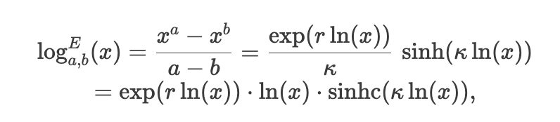
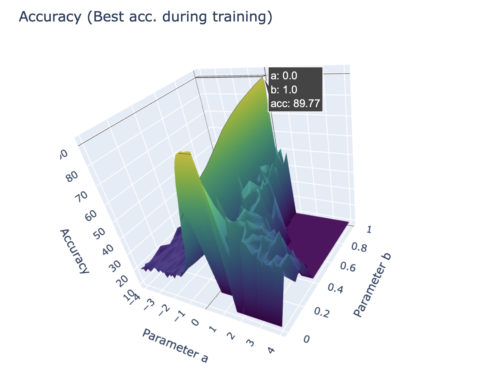
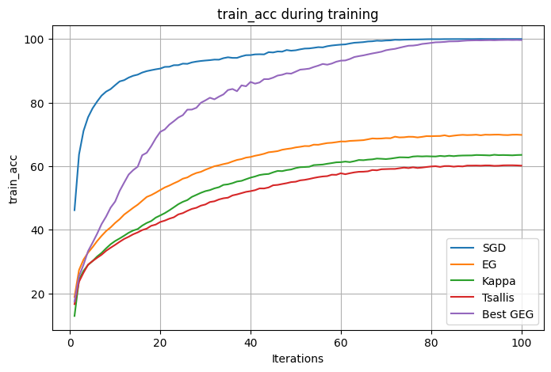
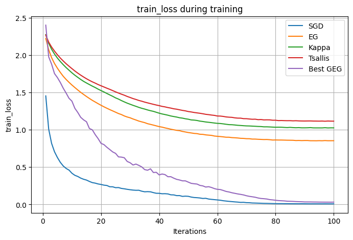
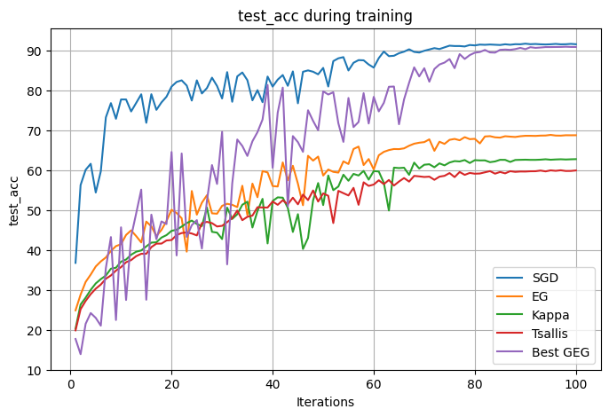
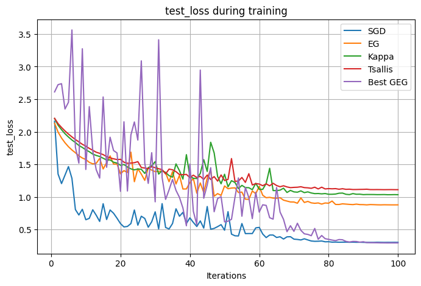
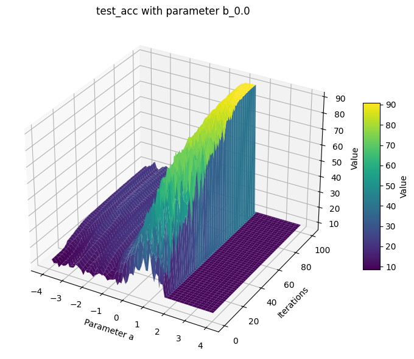
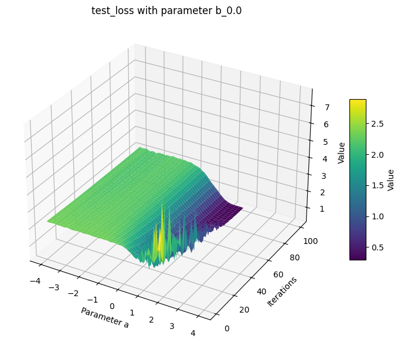
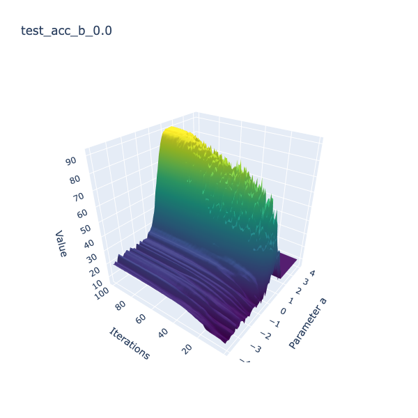
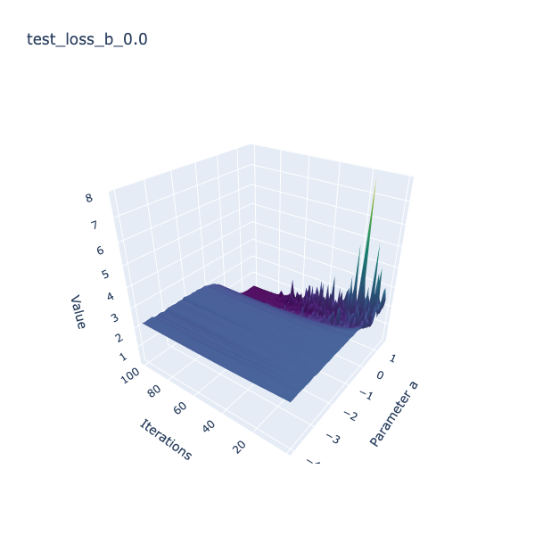

Code for *[Generalized Exponentiated Gradient Algorithms Using the Euler Two-Parameter Logarithm](https://arxiv.org/abs/2502.17500)*

<!-- 根据这篇文章，这个repository实现了Generalized Exponentiated Gradient （GEG）优化器，包括了GEGP optimizer （文章的Section 5: GEG Updates）以及GEG optimizer （文章的Section 6: 6 GEG Updates for Bipolar Weights）。在实验过程中GEG optimizer表现更加稳定。 -->
According to the paper, this repository implements the Generalized Exponentiated Gradient (GEG) optimizers, including the GEGP optimizer for positive domain (Section 5: GEG Updates) and the GEG optimizer for bipolar domain (Section 6: GEG Updates for Bipolar Weights). In experiments, the GEG optimizer demonstrates more stable performance.

<!-- 以下以GEG optimizer为例，对geg.py进行说明. 实验在这部分之后。 -->
**Below is an explanation of geg.py using the GEG optimizer as an example. The experiments follow this part.**

<!-- 首先，我们进一步调整了Eq. (24)如下： 新的形式在某些形式上更加直观，比如对于EG来说，a=b=0，即r=k=0，而k出现在分母位置可能引起误解。-->
### First,
we further adjust Eq. (24) as follows:

where $\mathrm{sinhc}(z) = \sinh(z) / z$. This new form is more intuitive in some ways. For example, for EG, we have $\log^{E}_{0,0}(x)=\ln(x)$, where both $r$ and $\kappa$ are zero, while having $\kappa$ in the denominator may cause misunderstanding. The above new formula is defined as `_log_geom()`, see `lines 23-74 in geg.py`.

<!-- 接下来，我们实现了对Euler (a, b)-log的求逆的算法. 文章中对Lambert–Tsallis方法进行了讨论，并Lagrange‘s inversion方法作为一种简单的替代方案。Although the Euler (a,b)-exponential admits a formal series expansion via the Lagrange inversion theorem, such expansions are not numerically practical for deep learning.
Therefore, consistent with mirror-descent practice, we compute \exp_{a,b}(y) via a stable Newton iteration, which converges rapidly due to the monotonicity and smoothness of \log_{a,b}. 这部分被定义为_exp_euler_newton(), see lines 77-128 in geg.py -->
### Next,
we implement the algorithm for inverting the Euler (a, b)-log. The paper discusses the Lambert–Tsallis method and Lagrange‘s inversion method as a simple alternative.

Although the Euler (a,b)-exponential admits a formal series expansion via the Lagrange inversion theorem, such expansions are not numerically practical for deep learning.
Therefore, consistent with mirror-descent practice, we compute $\exp_{a,b}(y)$ via a stable Newton iteration, which converges rapidly due to the monotonicity and smoothness of $\log_{a,b}$. This part is defined as `_exp_euler_newton()`, see `lines 77-196 in geg.py`

<!-- 最后，我们创建了GEG optimizer。根据文章中Section 6: GEG Updates for Bipolar Weights，我们将w拆成了两份整数进行更新，即文章中的Eqs. (72)~(74). Follow standard EG updates, GEG optimizer实现了 1. 计算梯度: g = p.grad；2. Map the weights to the mirror space by Euler (a,b)-log: log = _log_geom(); 3. update: log_u_new = log_u - lr * g,log_v_new = log_v + lr * g; 4. map back to original space: u/v = _exp_geom(), p = u-v.  -->
### Finally,
we create the GEG optimizer. According to Section 6: GEG Updates for Bipolar Weights in the paper, we split $w$ into two non-negative parts for updates, i.e., Eqs. (72)~(74) in the paper. Following standard EG updates, the GEG optimizer implements:
1. Compute the gradient: `g = p.grad`;
2. Map the weights to the mirror space by Euler (a,b)-log: `log = _log_geom()`;
3. Update: `log_u_new = log_u - lr * g`, `log_v_new = log_v + lr * g`;
4. Map back to the original space: `u/v = _exp_geom()`, `p = u-v`.

This is implemented in the `GEG class`, see `lines 199-306 in geg.py`.

## Experiments
<!-- 基于GEG，我们使用不同的ab在CIFAR-10分类任务进行了实验。尽管Eq.(18) 标注了a < 0，0 < b < 1，但为了更好的探索GEG的影响，我们在更广泛的范围内进行了实验。我们参照了Figure 1，将a从[-4,4]，b从[0,1]之间取值，step均为0.1，因此一共进行了81*11=891组实验结果，所有的训练以及评估log可以在./ablogs/geg/中找到，文件名由“geg+geg+{a}+{b}”组成，比如a=-0.1，b=0.0的实验结果可以在“geg+geg+-0.1+0.0.log”中找到。 -->
Based on GEG, we conduct experiments on the CIFAR-10 classification task using different values of `a` and `b` within 100 training iterations. Although Eq.(18) specifies `a < 0, 0 < b < 1`, to better explore the impact of GEG, we conduct experiments over a wider range.

Referring to Figure 1 in page 9, we vary `a` from `[-4, 4]` and `b` from `[0, 1]` both with a step size of 0.1, resulting in a total of 81*11=891 experimental results. All training and evaluation logs can be found in ./ablogs/geg/, with filenames formatted as "geg+geg+{a}+{b}". For example, the experimental results for `a = -0.1` and `b = 0.0` can be found in "geg+geg+-0.1+0.0.log".

<!-- 首先，我们给出了一个overview：在不同ab下的测试准确率，包括（a）在训练过程中的最高准确率，以及（b）迭代在最后一轮的准确率。 -->
### First,
we provide an overview of test accuracy under different values of `a` and `b`, including the highest accuracy during training and the accuracy at the last iteration.

 

We create 3D visualizations that can be viewed from different angles, as shown below. You can click [here](./figures/3d_best.html) and [here](./figures/3d_final.html) to adjust the angles yourself.

 

<!-- 正如文章中所讨论的一些内容相似，当 a>0,b>0 都偏大时：
	•	Euler-log 在 x>1 区域快速变成凸爆炸
	•	反函数 exp_{a,b}(y) 的增长比 exp 快得多
	•	一次更新就变 inf / nan -->
As discussed in the paper, when both `a > 0` and `b > 0` are relatively large:
- The Euler-log becomes convex explosion rapidly in the region x>1.
- The inverse function exp_{a,b}(y) grows much faster than exp.
- The parameters become inf/nan after a few update.

<!-- 此外，尽管Figure 1展示了a<0<b的曲线是moderately curved，形状类似 ln(x)，但带可控的弯曲度，这确实没有引发任何的梯度爆炸，但从实验结果上观察到，在CIFAR-10的分类任务下，其同样很难收敛。 -->
Figure 1 in the paper shows that the curve for `a < 0 < b` is moderately curved, resembling ln(x) with controllable curvature and not causing gradient explosion, but experimental results indicate that it is still difficult to achieve convergence on the CIFAR-10 classification task.

<!-- 此外，尽管文章申明使用ab两个可以更加灵活，同时可以统一已有的logarithm，但从实验准确率的指标上观察，最好的结果集中于a=0或者b=0的情况，这可能说明两个超参数虽然更加灵活，但也更难选择。 -->
Additionally, the paper uses both `a` and `b` allows for greater flexibility and unifies existing logarithms. From the experimental results, the best results are concentrated in cases where either `a = 0` or `b = 0`, which may indicate that while having two hyperparameters provides more flexibility, it also makes more challenging.

<!-- Next, 我们从训练过程中的准确率/损失的曲线图进行对比。我们选择了几种文章中常见的geometry，包括standard EG，Tsallis q-log，Kaniadakis κ-log，同时我们还加入了深度学习中的经典优化器，SGD与文章中的general Euler (a,b)-log进行对比。我们根据上面的内容选择最高准确率下的ab进行对比，其中a=1.6, b=0.0 -->
### Next,
we compare the accuracy/loss curves during the training process. We select several geometries commonly used in the paper, including standard EG, Tsallis q-log, and Kaniadakis $\kappa$-log. Additionally, we include the classic optimizer SGD from deep learning for comparison with the general Euler (a,b)-log discussed in the paper. Based on the previous results, we choose `a = 1.6` and `b = 0.0` for comparison, as they yield the highest test accuracy.

Training accuracy and loss curves:
 
Testing accuracy and loss curves:
 

<!-- 在选择了特定的ab后，GEG优化器确实实现了优异的性能，在高于其他logarithm的同时，性能几乎和SGD相当，展现出了其作为优化器的潜力。正如上面说的，目前是通过遍历的方式来确定最优的ab，在实际使用中，ab的选择可能是一个挑战。 -->
With the selected optimal `a` and `b`, the GEG optimizer achieves excellent performance, surpassing other logarithms and performing nearly on par with SGD, demonstrating its potential as an optimizer. However, as mentioned earlier, the optimal `a` and `b` are currently determined through a grid search, which may pose a challenge in practical applications.

<!-- 最后我们给出了在特定b下的的3d图，x和y轴分别表示a和iteration，z轴则是对应的value （accuracy/loss）。以下，我们仅展示了b=0.0时的结果，其余的结果可以在./figures/和./html/下找到。 -->
### Finally,
we present 3D plots for a specific value of `b`, where the x and y axes represent parameter `a` and `number of iterations`, respectively, and the z axis represents the corresponding value (`accuracy or loss`). Below, we only show the results for `b = 0.0`; other results can be found in ./figures/ and ./html/ directories.

 

 

<!-- 实验部分所展示的所有结果均由visual.ipynb生成. -->
All results presented in the experiments section are generated by `visual.ipynb`.

---

If you have any questions, please feel free to contact me by guang.lin@riken.jp
