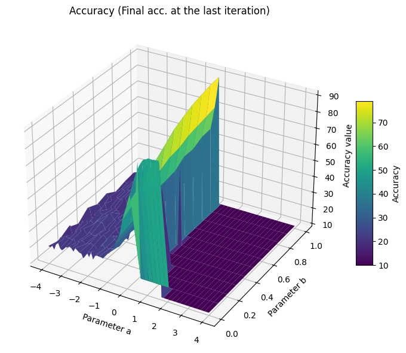

Code for *[Generalized Exponentiated Gradient Algorithms Using the Euler Two-Parameter Logarithm](https://arxiv.org/abs/2502.17500)*

<!-- 根据这篇文章，这个repository实现了Generalized Exponentiated Gradient （GEG）优化器，包括了GEGP optimizer （文章的Section 5: GEG Updates）以及GEG optimizer （文章的Section 6: 6 GEG Updates for Bipolar Weights）。在实验过程中GEG optimizer表现更加稳定。 -->
According to the paper, this repository implements the Generalized Exponentiated Gradient (GEG) optimizers, including the GEGP optimizer for positive domain (Section 5: GEG Updates) and the GEG optimizer for bipolar domain (Section 6: GEG Updates for Bipolar Weights). In experiments, the GEG optimizer demonstrates more stable performance.

<!-- 以下以GEG optimizer为例，对geg.py进行说明. 实验在这部分之后。 -->
**Below is an explanation of geg.py using the GEG optimizer as an example. The experiments follow this part.**

<!-- 首先，我们进一步调整了Eq. (24)如下： -->
### First,
we further adjust Eq. (24) as follows:
$$
\log^{E}_{a,b}(x)
= \frac{x^a - x^b}{a-b}
= \frac{\exp(r \ln(x))}{\kappa} \,\sinh(\kappa \ln(x)) \\
= \exp(r \ln(x)) \cdot \ln(x) \cdot \mathrm{sinhc}(\kappa \ln(x)),
$$
<!-- 新的形式在某些形式上更加直观，比如对于EG来说，a=b=0，即r=k=0，而k出现在分母位置可能引起误解。 -->
where $\mathrm{sinhc}(z) = \sinh(z) / z$. This new form is more intuitive in some ways. For example, for EG, we have $\log^{E}_{0,0}(x)=\ln(x)$, where both $r$ and $\kappa$ are zero, while having $\kappa$ in the denominator may cause misunderstanding. The above new formula is defined as _log_geom(), see lines 23-74 in geg.py.

<!-- 接下来，我们实现了对Euler (a, b)-log的求逆的算法. 文章中对Lambert–Tsallis方法进行了讨论，并Lagrange‘s inversion方法作为一种简单的替代方案。Although the Euler (a,b)-exponential admits a formal series expansion via the Lagrange inversion theorem, such expansions are not numerically practical for deep learning.
Therefore, consistent with mirror-descent practice, we compute \exp_{a,b}(y) via a stable Newton iteration, which converges rapidly due to the monotonicity and smoothness of \log_{a,b}. 这部分被定义为_exp_euler_newton(), see lines 77-128 in geg.py -->
### Next,
we implement the algorithm for inverting the Euler (a, b)-log. The paper discusses the Lambert–Tsallis method and Lagrange‘s inversion method as a simple alternative.

Although the Euler (a,b)-exponential admits a formal series expansion via the Lagrange inversion theorem, such expansions are not numerically practical for deep learning.
Therefore, consistent with mirror-descent practice, we compute $\exp_{a,b}(y)$ via a stable Newton iteration, which converges rapidly due to the monotonicity and smoothness of $\log_{a,b}$. This part is defined as _exp_euler_newton(), see lines 77-196 in geg.py

<!-- 最后，我们创建了GEG optimizer。根据文章中Section 6: GEG Updates for Bipolar Weights，我们将w拆成了两份整数进行更新，即文章中的Eqs. (72)~(74). Follow standard EG updates, GEG optimizer实现了 1. 计算梯度: g = p.grad；2. Map the weights to the mirror space by Euler (a,b)-log: log = _log_geom(); 3. update: log_u_new = log_u - lr * g,log_v_new = log_v + lr * g; 4. map back to original space: u/v = _exp_geom(), p = u-v.  -->
### Finally,
we create the GEG optimizer. According to Section 6: GEG Updates for Bipolar Weights in the paper, we split $w$ into two non-negative parts for updates, i.e., Eqs. (72)~(74) in the paper. Following standard EG updates, the GEG optimizer implements:
1. Compute the gradient: `g = p.grad`;
2. Map the weights to the mirror space by Euler (a,b)-log: `log = _log_geom()`;
3. Update: `log_u_new = log_u - lr * g`, `log_v_new = log_v + lr * g`;
4. Map back to the original space: `u/v = _exp_geom()`, `p = u-v`.

This is implemented in the GEG class, see lines 199-306 in geg.py.

## Experiments
<!-- 基于GEG，我们使用不同的ab在CIFAR-10分类任务进行了实验。尽管Eq.(18) 标注了a < 0，0 < b < 1，但为了更好的探索GEG的影响，我们在更广泛的范围内进行了实验。我们参照了Figure 1，将a从[-4,4]，b从[0,1]之间取值，step均为0.1，因此一共进行了81*11=891组实验结果，所有的训练以及评估log可以在./ablogs/geg/中找到，文件名由“geg+geg+{a}+{b}”组成，比如a=-0.1，b=0.0的实验结果可以在“geg+geg+-0.1+0.0.log”中找到。 -->
Based on GEG, we conduct experiments on the CIFAR-10 classification task using different values of a and b within 100 training iterations. Although Eq.(18) specifies $a < 0$, $0 < b < 1$, to better explore the impact of GEG, we conduct experiments over a wider range. Referring to Figure 1 in page 9, we vary $a$ from -4 to 4 and $b$ from 0 to 1 both with a step size of 0.1, resulting in a total of 81*11=891 experimental results. All training and evaluation logs can be found in ./ablogs/geg/, with filenames formatted as "geg+geg+{a}+{b}". For example, the experimental results for a=-0.1 and b=0.0 can be found in "geg+geg+-0.1+0.0.log".

<!-- 首先，我们给出了一个overview：在不同ab下的测试准确率，包括（a）在训练过程中的最高准确率，以及（b）迭代在最后一轮的准确率。 -->
First, we provide an overview of test accuracy under different values of a and b, including the highest accuracy during training and the accuracy at the last iteration.

 

<iframe src="./html/test_acc_best.html" width="49%" height="200"></iframe><iframe src="./html/test_acc_final.html" width="49%" height="200"></iframe>

<!-- 正如文章中所讨论的一些内容相似，a -->
